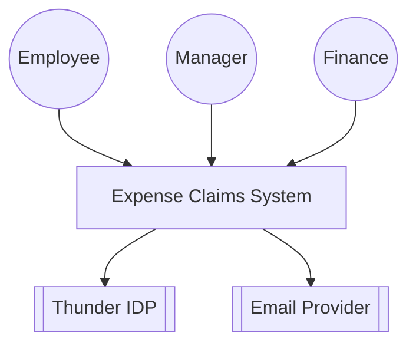
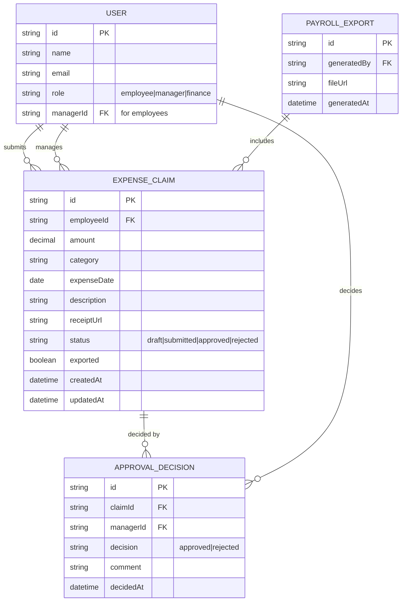
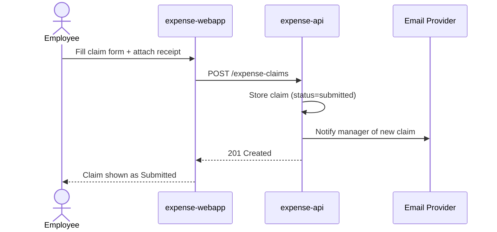
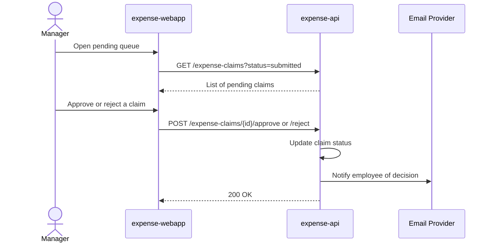
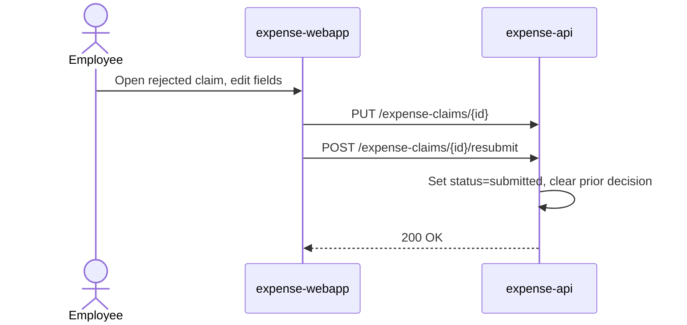
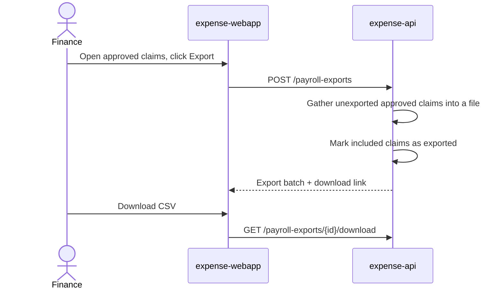

# Expense Claims — Design

Employees submit expense claims with a receipt through a single web
application; managers review and approve or reject them from a queue; and
finance reviews approved claims and generates a payroll export file. A
Ballerina service (`expense-api`) owns the full claim lifecycle and sends
email notifications on status changes; a React SPA (`expense-webapp`)
provides the three role-scoped experiences. Both sit behind the org gateway
and sign users in through Thunder.

## Context (C1)

## Domain model (ER)

## Key flows

### Employee submits a claim

### Manager approves or rejects a claim

### Employee resubmits a rejected claim

### Finance exports approved claims to payroll

